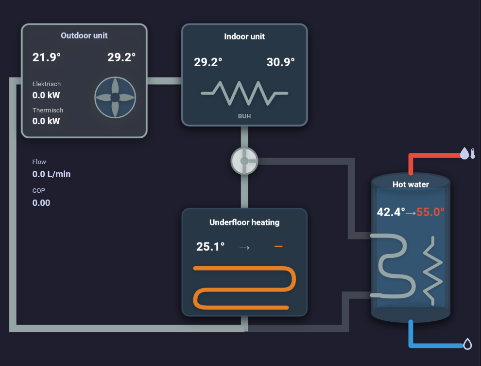

# Heat Pump Flow Card

A Home Assistant custom card for visualizing heat-pump water circuits. It supports a compact **Daikin split** layout and a configurable **standard** layout.



## Features

- Outdoor and indoor units, backup heater, three-way valve, hot-water tank and underfloor heating.
- Live temperatures, current → target temperatures, electrical and thermal power, COP and flow.
- Heating/cooling pipe colors; the standard layout also supports animated flow, buffer tanks, custom metrics and temperature indicators.

## Installation

**HACS:** Add [this repository](https://github.com/XMaarten/heat-pump-flow-card) as a custom dashboard/frontend repository, then install **Heat Pump Flow Card**.

**Manual:** Copy [`heat-pump-flow-card.js`](heat-pump-flow-card.js) to `config/www/` and add this dashboard resource:

```yaml
url: /local/heat-pump-flow-card.js
type: module
```

Reload the dashboard after installation. If an update does not appear, refresh the browser cache.

## Daikin split example

Replace the example entities with your Home Assistant entities. Electrical and thermal power sensors should provide watts (W).

```yaml
type: custom:heat-pump-flow-card
title: Heat Pump
show_logo: false
layout:
  type: daikin_split

heat_pump:
  display_name: Outdoor unit
  power_entity: sensor.heat_pump_power_w
  thermal_entity: sensor.heat_pump_thermal_power_w
  cop_entity: sensor.heat_pump_cop
  flow_rate_entity: sensor.heat_pump_flow
  inlet_temp_entity: sensor.heat_pump_return_temperature
  outlet_temp_entity: sensor.heat_pump_phe_outlet_temperature

indoor_unit:
  name: Indoor unit
  inlet_temp_entity: sensor.heat_pump_phe_outlet_temperature
  outlet_temp_entity: sensor.heat_pump_buh_outlet_temperature
  show_buh: true

aux_heater:
  enabled: true
  # state_entity: binary_sensor.backup_heater_active
  # power_entity: sensor.backup_heater_power_w

g2_valve:
  state_entity: binary_sensor.hot_water_running

dhw_tank:
  name: Hot water
  tank_temp_entity: sensor.hot_water_temperature
  target_temp_entity: number.hot_water_target
  electric_heater:
    enabled: true
    # state_entity: binary_sensor.hot_water_element_active
    # power_entity: sensor.hot_water_element_power_w

hvac:
  type: underfloor_heating
  name: Underfloor heating
  current_temp_entity: sensor.room_temperature
  target_temp_entity: sensor.room_target_temperature

grid_options:
  columns: full
```

The optional heater `state_entity` takes precedence over `power_entity` (positive W means active); `active_entity` is also accepted. The DHW coil turns red only during DHW flow, and the floor loop is gray when inactive.

Omit `layout` to use the standard layout. See the [standard configuration example](examples/cx50-configuration.yaml) and [configuration types](src/types.ts) for additional options.

## Support and credits

[Issues and feature requests](https://github.com/XMaarten/heat-pump-flow-card/issues) · [Original project](https://github.com/jasipsw/heat-pump-flow-card) · [MIT license](LICENSE)

Independent community project; not affiliated with or endorsed by any heat-pump manufacturer.
